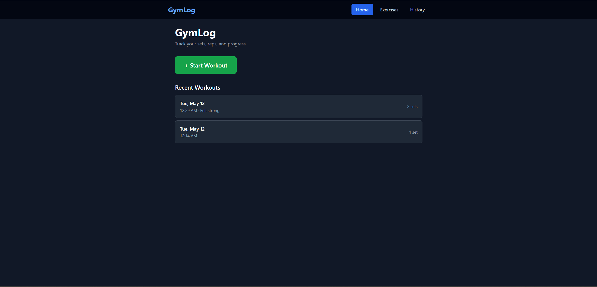
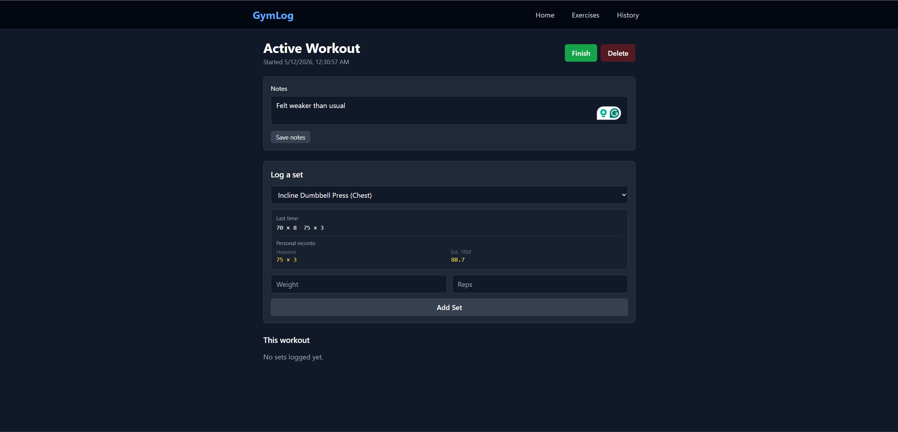
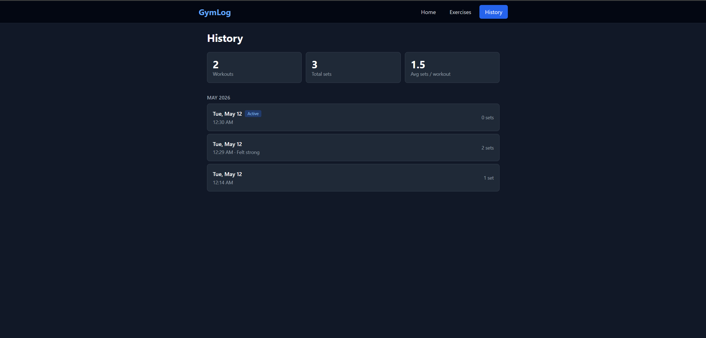
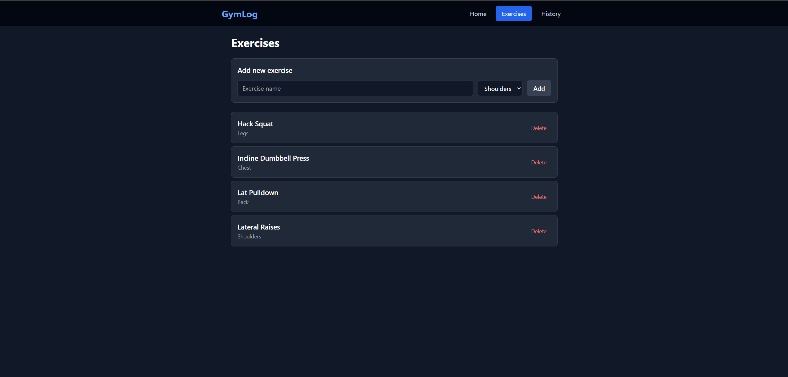

# GymLog

A full-stack workout tracker for logging sets, reps, and progress over time. Built to learn React, Express, and SQLite from the ground up — and because every workout app I tried was either bloated or required an account.

**Live demo:** https://gymlog-iuqn.onrender.com
**Backend API:** https://gymlog-jn24.onrender.com/api

> ⏳ The backend runs on Render's free tier and sleeps after 15 minutes of inactivity. The first request after sleep takes ~30 seconds to wake up. Subsequent requests are fast.

> 💾 The deployed instance uses an ephemeral database for the demo, so data resets on redeploys. For real use, run locally — the SQLite file persists in `server/db/gymlog.db`.

## Screenshots






## What it does

- **Exercise library** — add, list, and delete exercises grouped by muscle group
- **Workout sessions** — start a workout, log sets (weight × reps) against any exercise, add notes, finish
- **Last-time context** — when logging a set, see your previous session's sets for that exercise so you know what to beat
- **Personal records** — heaviest set and Epley-formula estimated 1-rep max, calculated server-side from your full history
- **Workout history** — grouped by month with summary stats (total workouts, total sets, avg sets/workout)
- **Set order is server-computed** — within a workout, sets for each exercise are numbered automatically based on insertion order

## Tech

**Frontend:** React 19 (Vite), React Router, Tailwind CSS
**Backend:** Node.js, Express, better-sqlite3, SQLite
**Deployed on:** Render (static site for frontend, web service for backend)

## Architecture

The project is a monorepo with two independent Node projects:
GymLog/
├── client/          # React SPA built with Vite
│   └── src/
│       ├── pages/     # Home, Workout, Exercises, History
│       ├── components/
│       └── api.js     # Single source of truth for API calls
└── server/          # Express REST API
├── routes/      # exercises.js, workouts.js, sets.js
└── db/          # schema.sql + better-sqlite3 connection
The frontend talks to the backend exclusively through the `api.js` helper, which centralizes the base URL (configurable via `VITE_API_URL` env var) and error handling.

The backend exposes a REST API. Three tables: `exercises`, `workouts`, `sets`. Foreign keys are enforced with `ON DELETE CASCADE` so deleting a workout cleans up its sets automatically. All queries use prepared statements.

### Notable design decisions

- **Single-user, no auth** — kept scope manageable and let the app focus on the actual problem (tracking workouts) instead of plumbing.
- **Server-computed set order** — the API decides what set number you're on, not the client. Keeps data consistent regardless of how the UI evolves.
- **Two `useEffect`s on the workout page** — one for initial load, one that fires only when the selected exercise changes. Separating effects by concern matches the React philosophy and keeps the data flow easy to reason about.
- **PR calculation server-side** — the `GET /api/exercises/:id/stats` endpoint runs the Epley formula across all historical sets and returns just the result, instead of shipping all sets to the client.
- **Env-driven configuration** — port, database path, API base URL, and CORS origins all read from env vars, so the same code runs locally and in production unchanged.

## API endpoints
GET    /api/exercises                 list exercises
POST   /api/exercises                 create exercise
DELETE /api/exercises/:id             delete exercise
GET    /api/exercises/:id/history     recent sets across workouts
GET    /api/exercises/:id/stats       PRs and totals
GET    /api/workouts                  list workouts (newest first, with set counts)
GET    /api/workouts/:id              workout detail with all sets joined
POST   /api/workouts                  start a workout
PATCH  /api/workouts/:id              update notes / mark ended
DELETE /api/workouts/:id              delete (cascades to sets)
POST   /api/workouts/:id/sets         add a set
DELETE /api/sets/:id                  remove a single set

## Running locally

You'll need Node.js 18+ and npm.

```bash
git clone https://github.com/Mbn27/GymLog.git
cd GymLog
```

**Start the backend** (terminal 1):
```bash
cd server
npm install
npm run dev   # nodemon, port 3001
```

**Start the frontend** (terminal 2):
```bash
cd client
npm install
npm run dev   # vite, port 5173
```

Open http://localhost:5173.

The SQLite database is created automatically at `server/db/gymlog.db` on first run.

## What I learned building this

This was my first project where the architecture decisions were mine instead of a coursework spec. The biggest practical lessons:

- **Where logic belongs.** I originally had the client compute set order; moving it to the server made the data trustworthy and the UI dumber. Same with PR calculation — putting it in a dedicated endpoint kept the client simple.
- **CORS is real.** The frontend on port 5173 couldn't reach the backend on 3001 until I configured `cors` middleware, and the *same issue* appeared again in production until I whitelisted the deployed frontend's origin.
- **React hooks click once you see the same pattern repeatedly.** Every page does fetch → load → display with `useState` + `useEffect` + try/catch. After the second page, it was muscle memory.
- **SQL JOINs go from abstract to obvious** the moment you need to display set history with exercise names attached in one query.
- **Production-readiness is mostly env vars.** Hardcoded URLs and ports work until they don't. Threading config through env vars from day one would have saved me a deployment debug session.

## License

MIT